## 专题一

- 马克思的《关于费尔巴哈的提纲》系统论述了实践的观点，揭示了科学实践观的基本内容
- 马克思所著的《资本论》，系统阐述了剩余价值学说，揭示了资本主义生产关系的秘密
- 唯物史观和剩余价值学说是马克思一生的两个伟大发现
- 马克思主义的基本特征：科学性、人民性、实践性、发展性。用一句话来概括就是科学性与革命性的统一。

## 专题二

- 哲学的基本问题：思维与存在的关系
    - 思维和存在的地位问题（本体论）：唯心主义和唯物主义
    - 思维和存在的同一性问题（认识论）：可知论和不可知论

### 哲学的主要观点、内部形态及其代表人物

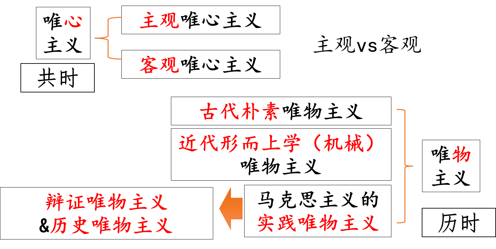

- 唯心主义
    - 主观唯心主义：**把个人的感觉、心灵、意识、观念夸大为第一性的东西**，认为物质世界和客观规律依赖于人的意识而存在。
    
    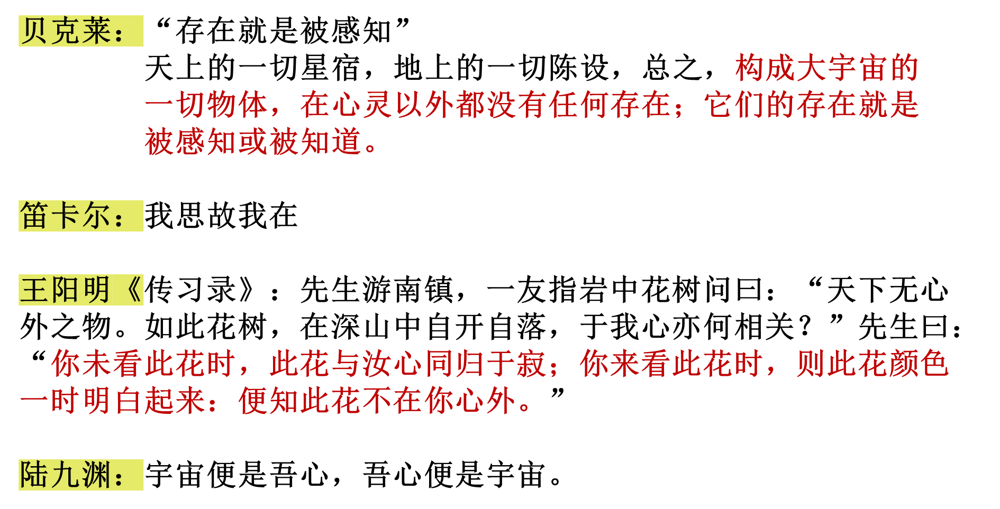
    
    - 客观唯心主义：**把某种“客观精神”看作是先于并独立于物质世界的存在**，并把物质世界说成是这种“客观精神”的产物、表现或附属品。
    
    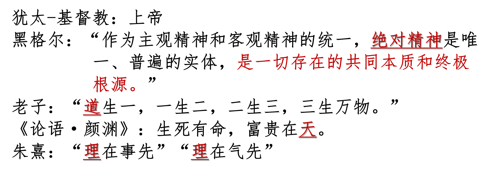
    
- **唯物主义（三个形态）**
    - 古代朴素唯物主义：以自然原因去解释自然现象，**以一种或几种物质形态去理解和解释世界**，肯定世界的物质本原性和统一性。
    
    
    
    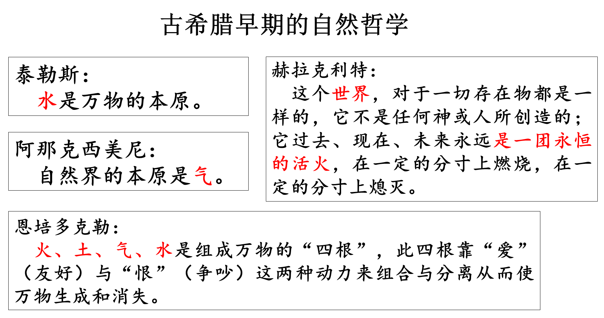
    
    - 近代形而上学（机械）唯物主义：以近代科学对自然现象的实证研究为基础，**以新的实证知识和科学方法论证世界的物质统一性**。摆脱了古代唯物主义的朴素性，但带有形而上学性、机械性。
    
    
    
    > …它在发展中变得片面了。以原子论为基础建构起来的世界统一性大厦，**把人类社会和人的实践活动都排斥在了“世界”之外**，因而只能是一种抽象的、不彻底的唯物主义，一旦进入社会历史领域就陷入了唯心主义。
    > 
    - 马克思主义的实践唯物主义：辩证唯物主义和历史唯物主义

## 专题四

- 物质决定意识的主要表现
    - 从意识的起源看
        1. 意识是自然界长期发展的产物
        2. 意识是社会历史发展的产物
    - 从意识的本质看
        1. 意识是人脑的机能
        2. 意识是物质世界的主观映象
- 人工智能与人类意识的关系
    - 人工智能实质上是对人脑组织结构与思维运行机制的模仿，是人类智能的物化。是人的意识能动性的一种特殊表现，是人的本质力量的对象化、现实化。
    - 人工智能不能取代或超越人类智能，原因：
    
    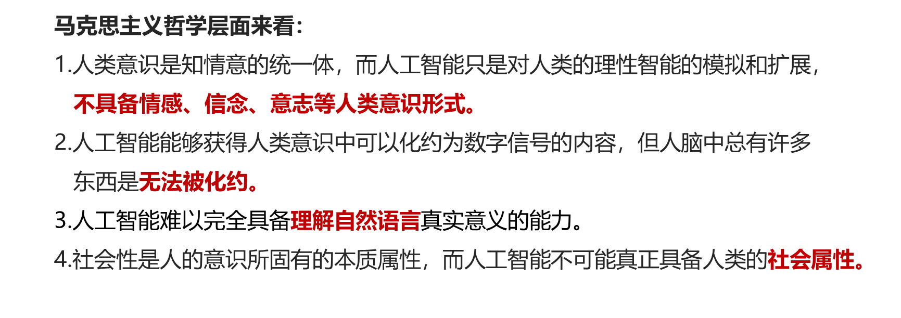
    

## 专题五

- 运动与静止的辩证关系
    - 物质世界的存在是绝对运动和相对静止的统一

## 专题六

- 联系
    - 内涵：联系是指事物内部各要素之间和事物之间相互影响、相互制约和相互作用的关系。
    
    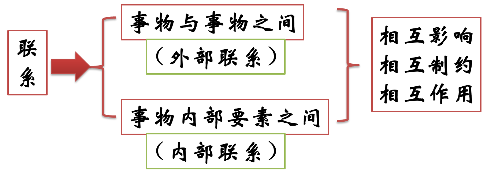
    
    - 特点：
        1. 联系具有**客观**性。事物的联系是事物本身所固有的、不以人的意志为转移的。 方法论：从客观事物本身固有的联系出发去认识事物。坚持联系的客观性，就是在联系的观点上坚持了唯物论。
        2. 联系具有**普遍**性。
        3. 联系具有**多样**性。
        4. 联系具有**条件**性。联系是矛盾着的事物的联系，事物之间的联系是有条件的。
    
    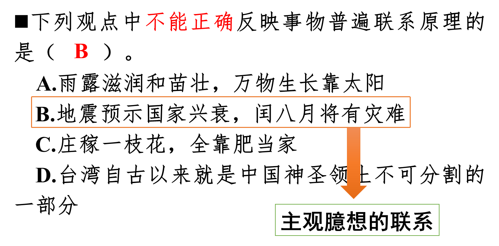
    
    - 联系的观点是唯物辩证法的总特征之一
- 矛盾的普遍性和特殊性
    - 普遍性
        - 一是矛盾存在于一切事物中，**矛盾无处不在；**二是矛盾存在于一切事物发展过程的始终，**矛盾无时不有。**旧的矛盾解决了，新的矛盾又产生，事物始终在矛盾中运动。
        - 方法论：
            1. 要求我们承认矛盾，分析矛盾，勇于揭露矛盾，积极寻找正确的方法解决矛盾。
            2. 要善于用全面的观点看问题，坚持两分法(一分为二)，防止片面性。
    - 特殊性
        - 各个具体事物的矛盾、每一个矛盾的各个方面在发展的不同阶段上各有其特点。矛盾的特殊性决定了事物的不同性质。
        - 方法论：要想认清事物的本质和发展规律，就必须要去具体分析矛盾的特殊性，并且根据矛盾的特殊性采取相应的措施去解决矛盾，即**具体问题具体分析**，切忌照抄照搬。
    - 矛盾的普遍性与特殊性的辩证关系
        - 对立：矛盾的普遍性即矛盾的**共性**，矛盾的特殊性即矛盾的**个性**。矛盾的共性是**无条件的、绝对的**，矛盾的个性是**有条件的，相对的**。
        - 统一：任何现实存在的**事物的矛盾都是共性和个性的有机统一**，**共性寓于个性之中**，没有离开个性的共性，也没有离开共性的个性。
    - 矛盾的普遍性和特殊性辩证关系原理的指导意义：矛盾的普遍性和特殊性辩证关系原理，不仅是马克思主义基本原理同各国具体实际相结合的哲学基础，也是中国特色社会主义的哲学依据。
- 度的启示：在认识和处理问题时，要**掌握适度原则**。
- 否定之否定规律：揭示事物变化发展的过程和方向
    - 唯物辩证法揭示的否定的科学内涵：
        1. 否定是事物发展的环节，是旧事物向新事物的转变，是旧质到新质的飞跃
        2. 否定是新旧事物联系的环节
        3. 辩证否定的实质是“扬弃”，既批判又继承，既克服又保留
        4. 否定是事物的自我否定、自我发展，是事物内部矛盾运动的结果
    - 事物的辩证发展过程所经过的两次否定、三个阶段：
        1. 事物的辩证否定不是一次完成的，而是经历事物自我发展的两次否定、三个阶段，即“肯定一否定一否定之否定”的有规律的过程。
        2. 第一次否定使矛盾得到初步解决，而处于否定阶段的事物仍然具有片面性、还要经过再次否定，即否定之否定，实现对立面的统一、使矛盾得到根本解决。
        3. 事物的发展呈现出周期性，不同周期的交替使事物的发展呈现出波浪式前进或螺旋式上升的总趋势。
        
        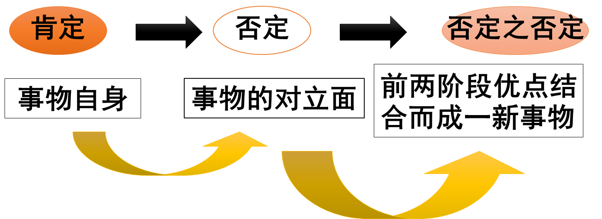
        
    - 否定之否定规律的内容
        - 揭示了事物发展的**前进性与曲折性的统一**。
        - **前进性**：每一次否定都是质变，都把事物推向新的阶段，每一周期都是开放的，不存在不被否定的终点
        - **曲折性：**体现在回复性和倒退性上，但是经过曲折终将为事物的发展开辟道路，前途是光明的，道路是曲折的。事物的发展是**螺旋式上升波浪式前进**
    - 否定之否定规律的要求
        1. 正确认识**事物发展的曲折性和前进性**
        2. 对待一切事物都要采取**科学分析**的态度（一分为二：既肯定又否定），**反对**肯定一切和否定一切的**形而上学否定观**

## 专题七

- 实践与认识
    - 关系：实践是认识的基础，在认识活动中起决定性作用。
    - 具体体现：
        1. 实践是认识的根本来源
        2. 实践是认识发展的动力
        3. 实践是认识的最终目的
        4. 实践是检验认识真理性的唯一标准
- 感性认识与理性认识（第一次飞跃）
    - 感性认识
        - 内涵：感性认识是人们在**实践基础**上，由**感觉器官**直接感受到的关于事物的**现象**、事物的**外部联系、事物的各个方面**的认识。
        - 形式：感觉、知觉、表象
        - 特点：直接性和具体性
    - 理性认识
        - 内涵：理性认识是对事物的本质、全体、内部联系和事物自身规律性的认识。
        - 形式：概念、判断、推理
        - 特点：抽象性和间接性
    - 辩证关系：
        1. 理性认识依赖于感性认识
        2. 感性认识有待于发展和深化为理性认识
        3. 感性认识和理性认识相互渗透、相互包含
    
    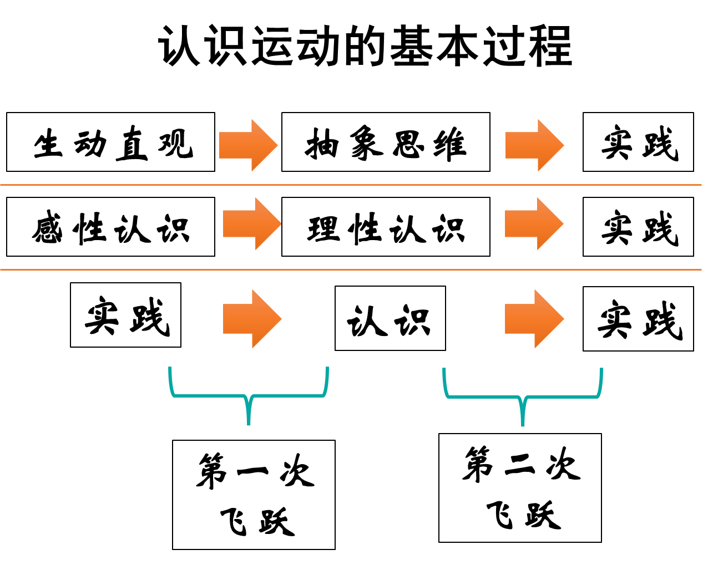
    

## 专题八

- 真理
    - 绝对性：是指真理**主客观统一的确定性**和**发展的无限性**。包含两个方面的含义：
        1. 任何真理都具有客观性
        2. 任何真理都是对无限发展的物质世界的接近
    - 相对性：任何真理都知识主观对客观事物近似（相对）正确的反映，是有限度、不完善的
    - 绝对性和相对性的辩证统一关系：
        1. 二者相互依存，每一个正确认识都是既相对又绝对；
        2. 二者相互包含，绝对性寓于相对性之中，相对性中包含并表现着绝对性。
- 价值
    - 价值的内涵：价值是**反映主体和客体之间意义关系**的哲学范畴，是客体对个人、群体乃至整个社会的生活和活动所具有的意义。
    - 基本特征：
        - **价值的主体性：**指价值直接同主体相联系，始终以主体为中心。
        - **价值的客观性：**指在一定条件下客体对于主体的意义不依赖于主体的主观意识而存在。
        - **价值的多维性：**指每个主体的价值关系具有多样性，同一客体相对于主体的不同需要会产生不同的价值。
        - **价值的社会历史性：**主体和客体的不断变化决定了价值的社会历史性特点。
    - 价值评价的最高标准：对于任何主体而言，**是否推动社会历史进步，是否符合社会发展趋势，是否维护、满足了最广大人民的需要和根本利益**，是价值评价的最高标准，是判断特定主体实际需要是否合理的最高尺度。

## 专题九

- 社会意识
    - 社会意识的内涵：是社会存在的反映，是社会生活的精神方面。
    - 分类：
        - 根据主体划分，可分为个人意识与群体意识；
        - 根据不同层次，可分为社会心理（感性认识）与社会意识（理性认识）
    
    > 辨别意识形态和非意识形态
    > 
    > 
    > **意识形态**：
    > 
    > - 反映一定经济关系、政治关系
    > - 反映一定阶级或社会集团利益和要求
    > 
    > **非意识形态：**自然科学、逻辑学等
    > 

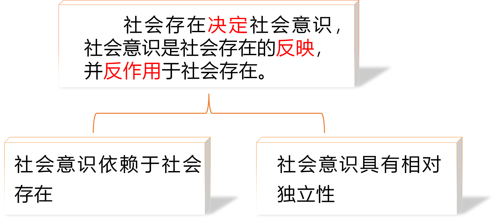

- 社会存在与社会意识的辩证关系：社会存在决定社会意识，社会意识是社会存在的反映，并反作用于社会存在。
    - 指导意义
        - **理论意义：**在人类思想史上第一次正确解决了社会历史观的基本问题，宣告了唯心史观的破产，实现了社会历史观的革命性变革
        - **现实意义：**
            - 社会存在决定社会意识——坚持以经济建设为中心
            - 社会意识对社会存在有反作用——巩固意识形态，坚持“两个结合”

## 专题十一

- 科学技术在社会发展中的作用
  
  
    |  | 工业革命 | 第二次科技革命 | 新科技革命 |
    | --- | --- | --- | --- |
    | 时间 | 18世纪70年代至19世纪中期 | 19世纪末20世纪初 | 20世纪中期以后 |
    | 标志 | 蒸汽机的发明 | 电力的广泛运用 | 原子能的利用、电子计算机和空间技术的发展、高科技的出现 |
    |对生产力的影响 | 使资本主义生产迅速过渡到机器大工业 | 社会生产力又一次得到迅猛发展 | 推动了由工业经济形态向信息社会或知识经济形态的过渡 |
    | 对生产关系的影响 | 为资本主义生产方式的确立奠定了物质基础 | 使资本主义从自由竞争阶段发展到垄断阶段 | 促使生产关系进行了局部调整，使垄断资本主义向新的方向发展 |
    - **积极：**科技革命是推动经济和社会发展的强大杠杆
    - **消极：**
        1. 对自然规律和人与自然的关系认识不够，或缺乏对科技消极后果的强有力的控制手段
        2. 资本主义制度下，科技常被资产阶级用作剥削压迫人民的工具，并非都能使人摆脱贫困，从而科技成为“异己”的存在
    - 如何正确运用科学技术为人类造福：首要的是有合理的社会制度保障科学技术的正确运用，始终坚持科学技术为人类社会的健康发展服务，让科学技术为人类造福。
- 两种历史观在历史创造者问题上的**对立**：唯心史观是英雄史观，唯物史观是群众史观
    - 马克思提出的唯物史观是正确的
- **人民群众**
    - **内涵：**从**质**上看，人民群众是指一切对社会历史发展起推动作用的人；从**量**上看，人民群众是指社会人口的绝大多数。
    - **主体**：人民群众最稳定的主体始终是从事物质资料生产的劳动群众。人民群众是社会历史的主体，是历史的创造者。
    - **体现**（在创造历史过程中的**作用**）**：**
        1. 社会**物质财富**的创造者
        2. 社会**精神财富**的创造者
        3. **社会变革**的决定力量

## 专题十二

- 商品的二因素：使用价值和价值
    - 使用价值：是指商品能满足人的某种需要的**有用性**。
    - 价值：是凝结在商品中的**无差别的一般人类劳动，**即人的脑力和体力的耗费，是商品的**社会属性，本质上体现了生产者之间的社会关系。**
- 劳动的二重性：劳动的二重性是指生产商品的劳动既是**具体劳动**过程，又凝结**抽象劳动**。
    - 具体劳动：生产一定**使用价值**的具体形式的劳动。
    - 抽象劳动：撇开一切具体形式的**无差别的一般人类劳动**，即人的体力和脑力的耗费。

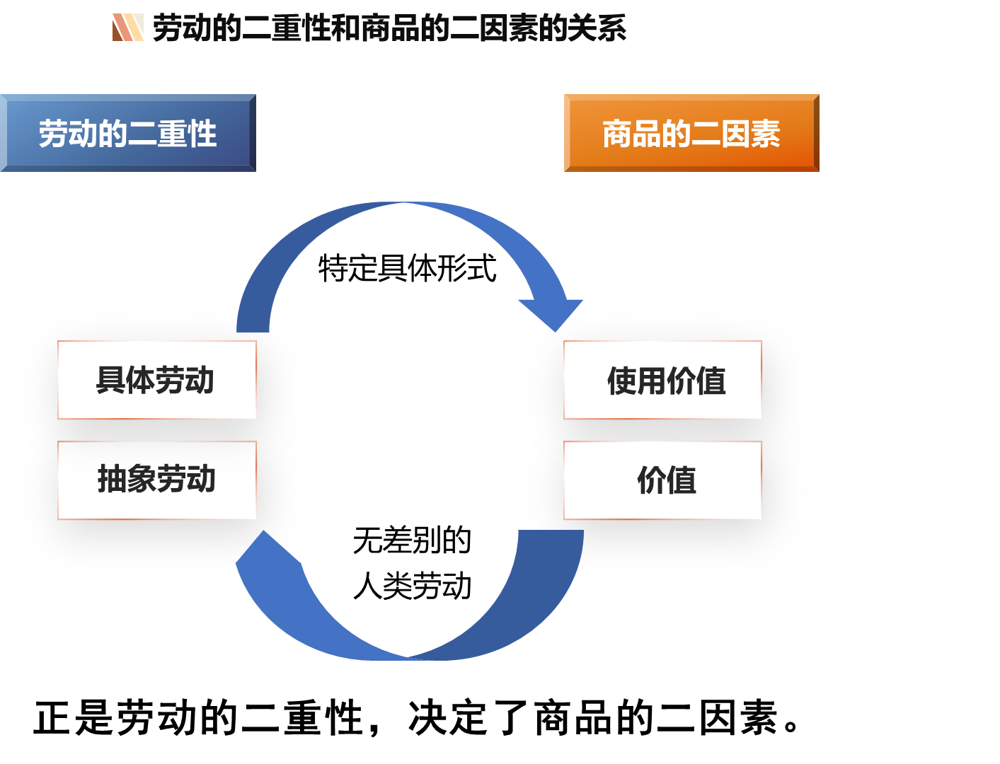

## 专题十三

- 剩余价值生产的两种基本方法
    1. **绝对剩余价值的生产：**在**必要劳动时间不变**的条件下，延长劳动日的长度，提高工人劳动强度
       
        
        
    2. **相对剩余价值的生产：**在工作日不变的前提下，通过缩短必要劳动时间从而**相对延长剩余劳动时间**生产剩余价值的方法
       
        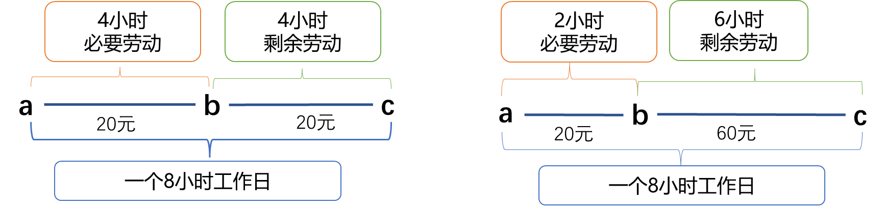
        
    
    > 加班是绝对剩余价值的生产，提高劳动率是相对剩余价值的生产
    > 
    - 剩余价值率反映资本家对工人的剥削程度

## 专题十四

- 第二次世界大战后资本主义变化的原因
    1. 科学技术革命和生产力的发展，是资本主义发生变化的根本推动力量
    2. 工人阶级争取自身权利和利益的斗争，是推动资本主义发生变化的重要力量
    3. 社会主义制度显示了优越性，对资本主义产生了重要影响
    4. 主张改良主义的政党对资本主义制度的改革，也对资本主义发生变化起到了重要作用
- 社会主义代替资本主义的必然性
    1. 资本主义基本矛盾“包含着现代的一切冲突的萌芽”，只有用社会主义生产方式取而代之，才能根本解决资本主义生产方式的基本矛盾
    2. 资本积累推动资本主义基本矛盾不断激化并最终否定资本主义自身
    3. 国家垄断资本主义是资本社会化的更高形式，将成为社会主义的前奏
    4. 无产阶级与资产阶级的矛盾和斗争，推动了资本主义向社会主义的转变
    5. 社会主义代替资本主义是一个长期的历史过程

## 专题十五

- 科学社会主义与空想社会主义的根本区别：立场、观点和方法是否科学
- 科学社会主义的基本原则
    1. 资本主义必然灭亡，社会主义必然胜利
    2. 无产阶级是最先进最革命的阶级，肩负着推翻资本主义旧世界、建立社会主义和共产主义新世界的历史使命
    3. 无产阶级革命是无产阶级进行斗争的最高形式，以建立无产阶级专政的国家为目的
    4. 社会主义社会要在生产资料公有制基础上组织生产，以满足全体社会成员的需要为生产的根本目的
    5. 社会主义社会要对社会生产进行有计划的指导和调节，实行按劳分配原则
    6. 社会主义社会要合乎自然规律地改造和利用自然，努力实现人与自然的和谐共生
    7. 社会主义社会必须坚持科学的理论指导，大力发展社会主义先进文化
    8. 无产阶级政党是无产阶级的先锋队，社会主义事业必须始终坚持无产阶级政党的领导
    9. 社会主义社会要大力解放和发展生产力，逐步消灭剥削和消除两极分化，实现共同富裕和社会全面进步，并最终向共产主义社会过渡
    10. 共产主义是人类最美好的社会，实现共产主义是共产党人的最高理想
- 正确把握科学社会主义基本原则
    1. 必须坚持科学社会主义基本原则，反对偏离科学社会主义基本原则的错误倾向。
    2. 善于把科学社会主义基本原则**与本国实际和时代特征相结合**，创造性地回答和解决社会主义革命、建设、改革中的重大问题。
    3. 紧跟时代和实践的发展，在不断总结新鲜经验中进一步丰富和发展科学社会主义基本原则。

## PDF 下载

[2023-Course-Marx.pdf](https://raw.githubusercontent.com/hongjr03/hongjr03.github.io/master/content/page/files/2023-Course-Marx/马克思主义基本原理2023秋.pdf)