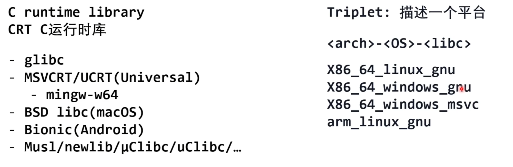
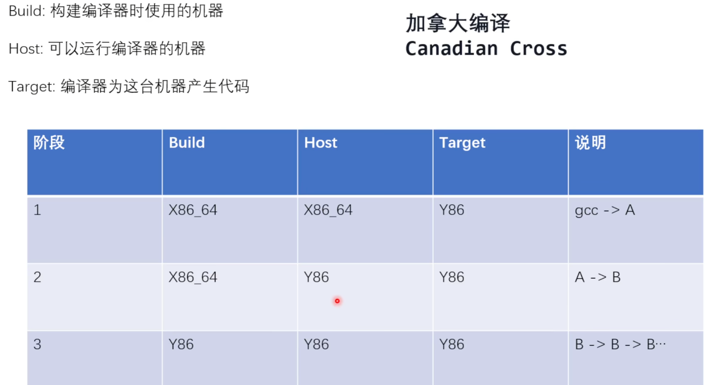



## gcc的常用编译选项

gcc的参数组合比较随意，比如`-Wall` 其实就是`-W all` ，有时候空格等号和粘连的写法都是等价的，但像`-O1` 就不能分开写。

`-E` 预处理

`-v` 打印输出信息（默认quiet）

`-` 从stdio中读取输入

## 多文件编译和第三方库

用makefile举例。先生成目标文件（`.o`）再链接成可执行文件，相较于直接使用两个源文件编译成可执行文件，能够避免未修改的文件也要重新编译的开销。

```makefile
main: main.o a.o
		gcc $^ -o $@
%.o: %.c
		gcc -c $^ -o $@
```

makefile能够简化成上面这么写，而不需要展开写所有的文件。`$^` 就代表上面所有的依赖，`$@` 指的就是冒号前面这个要输出的文件，`%` 是个模式的匹配。

更好地，还可以提取出所有的变量。

```makefile
CC = gcc
SRC = main.c a.c
OBJ = $(SRC:.c=.o)

main: $(OBJ)
		$(CC) $^ -o $@
%.o: %.c
		$(CC) -c $^ -o $@
```

有时，文件目录嵌套了非常多层，要包含头文件时就需要写很多次的`".."` ，既不简洁也不优雅。gcc中可以使用`-I` 这个编译选项来指定include目录，而不需要相对引用。

```makefile
CC = gcc
SRC = main.c a.c
OBJ = $(SRC:.c=.o)
INCLUDE_PATH = -Ifolder/ -Iinclude1 -I include2

main: $(OBJ)
		$(CC) $^ -o $@
%.o: %.c
		$(CC) -c $(INCLUDE_PATH) $^ -o $@
```

使用第三方库的时候，在Linux上`apt` 安装后只需要加入几个`-l` 选项就可以使用了。如果说修改了源码，想要用修改后的自己的库，那就要自己引入`INCLUDE_PATH` 和`LIBRARY_PATH` ，通常情况下程序会优先使用动态链接库（`.a` 或`.la` 结尾）以减小体积。`apt` 安装库时，把可执行文件放在`/usr/bin` ，头文件放在`/usr/include` ，库文件放在`/usr/lib` ，gcc就能默认从这几个路径下搜索包含。

```makefile
CC = gcc
SRC = main.c a.c
OBJ = $(SRC:.c=.o)
INCLUDE_PATH = 
LDFLAGS = -lgvs -lcgraph -lcdt

main: $(OBJ)
		$(CC) $^ $(LDFLAGS) -o $@
%.o: %.c
		$(CC) -c $(INCLUDE_PATH) $^ -o $@
```

pkg-config是一个能根据package自动补全include和library路径的工具，这样只需要提供CFLAGS和LDFLAGS就可以了。下面使用的 `ˋ`在shell中会先执行，然后用返回的值替代。

```makefile
CC = gcc
SRC = main.c a.c
OBJ = $(SRC:.c=.o)

CFLAGS = `pkg-config libgvc --cflags`
# -I/usr/include/graphviz
LDFLAGS = `pkg-config libgvc --libs`
# -lgvs -lcgraph -lcdt

main: $(OBJ)
		$(CC) $(CFLAGS) $^ $(LDFLAGS) -o $@
%.o: %.c
		$(CC) -c $(CFLAGS) $^ -o $@
```



## 跨平台和交叉编译

编译出来的文件会有一个可执行的`configure` 文件，这和gnu的构建三件套GNU build system（automake，autoconf和libtools）有关。主要目的就是简化跨平台软件的构建过程。但最好用cmake来构建跨平台应用。

API是应用程序接口，ABI指的是应用程序二进制接口，和硬件、操作系统、编译器等等有关系。

出现一个新架构之后，如何将已有的编译器引入新架构？使用加拿大编译。



3阶段实现自举。