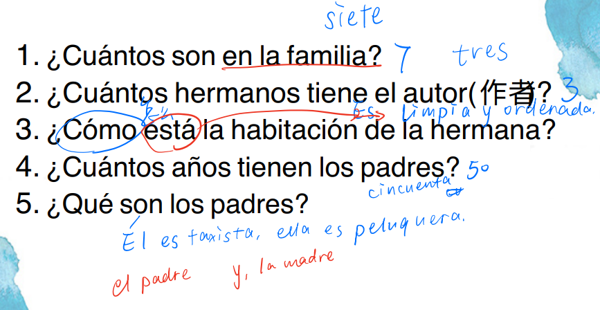
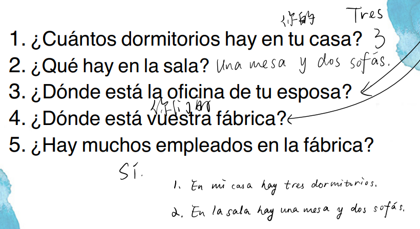
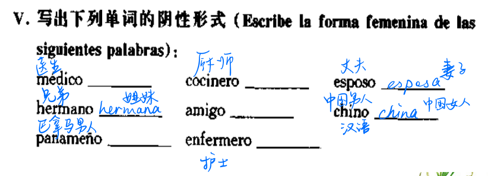
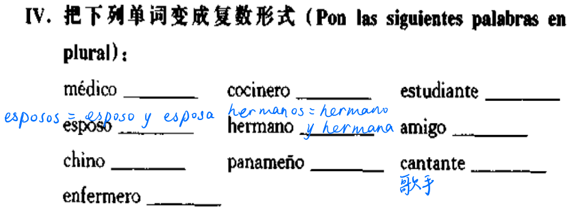

## 题型

1. 选择，根据问句选合适的答句（$20 \times 1'$）
    - 1-10 日常用语，参考口语考试
    - 11-18 语法点，动词变位
    - 19-20 文化常识
2. 连词成词组（$10 \times 2'$）
    - 语法点，性数一致
3. 阅读短文，选择（$2\times5\times1'$）
4. 阅读短文，回答问题（$2\times5\times2'$）
    - 类似第4、5课的形式

    

    

5. 翻译句子（$2\times5\times2'$）
    - 中译西，西译中
6. 作文，80~120词（$10'$）
    - Mi Familia / Mi Casa
    - 起评分7~8，可能扣分或加分（扩充内容）

## 语法

### 性数一致

- 名词和形容词的阴阳性：注意特例
  
  - 名词阴阳性

    - 阳性：以o结尾，amigo
    - 阴性：以a结尾，amiga
    - 无阴阳性：estudiante, joven

  - 形容词的阴阳性

    - 阳性：以o结尾，alto
    - 阴性：以a结尾，alta
    - 无阴阳性：grande，joven
- 名词和形容词的单复数：可能需要增减重音符号**保持原有重音不变**
  
  - 名词单复数

    - 元音结尾：+s，amigos
    - 辅音结尾，+es，señores

  - 形容词的单复数

    - 元音结尾：+s，altos
    - 辅音结尾，+es，trabajadores

  - 名词单复数、阴阳性练习

    

    

  - 名词和形容词性数一致练习

    - 高个子的先生 señor **A. alto** B. alta C. altos D.altas
    - 高个子的女士们 señoras A. alto B. alta C. altos **D.altas**
    - 勤劳的男医生 medico trabajador
    - 年轻的女护士们 enfermeras j**ó**venes
- 指示形容词（指示代词）
  
  - 指示形容词：书写时**不带**重音符号，放在修饰的名词**之前**，性数一致

    |  | 单数 | 复数 |
    | --- | --- | --- |
    | 这个，这些 | este, a | estos, as |
    | 那个，那些 | ese, a | esos, as |
    | 那个，那些 | aquel, lla | aquellos, as |

  - 指示代词

    |  | 单数 | 复数 |
    | --- | --- | --- |
    | 这个，这些 | éste, a | éstos, as |
    | 那个，那些 | ése, a | ésos, as |
    | 那个，那些 | aquél, lla | aquéllos, as |

  - 职业表达练习

    - 这位先生是马努埃尔。是西班牙语专业的学生。
    Este señor es Manuel. Es un estudiante de español.
    - 这位先生是戴维。是企业家。是中国人。
    Este señor es David. Es un empresario. Es chino.
    - 这位小姐是苏珊娜。是秘书。是青岛人。
    Esta señorita es Suzanne. Es secretaria. Es de Qingdao.
    - 那些年轻的西班牙人是贝贝、巴科和爱玛。贝贝是服务员，巴科是秘书，爱玛是护士。
    Esos jóvenes españoles son Bebe, Paco y Emma. Bebe es camarera, Paco secretaria y Emma enfermera.
    - 这是戴维和爱玛。戴维是医生。是贝贝和巴科的父亲（padre）。
    Éstos son David y Ema. David es médico. Es padre de Pepe y Paco.
    - 爱玛不是医生，是护士。是戴维的妻子以及贝贝和巴科的母亲（madre）。
    Ema no es médica. Es enfermera. Es esposa de David y madre de Pepe y Paco.
    - 我叫李欣。我是中国人。我是秘书。我和贝贝还有巴科是好朋友。
    Me llamo Li Xin. Soy china. Soy secretaria. Pepe, Paco y yo somos amigos.
- 冠词

    |  | 定冠词 | 不定冠词 |
    | --- | --- | --- |
    | 单数 | el / la | un / una |
    | 复数 | los / las | unos / unas |
  - de el → del
  - a el → al
- 冠词（数词）、名词和形容词的性数一致

  - 一位高个子的先生 un señor alto
  - 一些高个子的女士们 unas señoras altas
  - 那位勤劳的男医生 el doctor trabajador
  - 那些年轻的女护士们 **las** enfermeras jóvenes

### 动词变位

- 主格人称代词

    |  | 单数 | 复数 |
    | --- | --- | --- |
    | 第一人称 | yo | nosotros, as |
    | 第二人称 | tú | vosotros, as |
    | 第三人称 | él / ella / usted | ellos, as / ustedes |
- 非重读物主形容词

    |  | 单数 | 复数 |
    | --- | --- | --- |
    | 第一人称 | mi, mis | nuestro, a / nuestros, as |
    | 第二人称 | tu, tus | vuestro, a / vuestros, as |
    | 第三人称 | su, sus | su, sus |
- 动词变位
  
  - 规则动词变位

    - -ar

        |  | 单数 | 复数 |
        | --- | --- | --- |
        | 第一人称 | -o | -amos |
        | 第二人称 | -as | -áis |
        | 第三人称 | -a | -an |

        estudiar, hablar, trabajar, descansar（休息）

    - -er

        |  | 单数 | 复数 |
        | --- | --- | --- |
        | 第一人称 | -o | -emos |
        | 第二人称 | -es | -éis |
        | 第三人称 | -e | -en |

        aprender（学习某种技能）, leer, beber, comprender（理解）

    - -ir

        |  | 单数 | 复数 |
        | --- | --- | --- |
        | 第一人称 | -o | -imos |
        | 第二人称 | -es | -ís |
        | 第三人称 | -e | -en |

        vivir（生活，居住）, discutir（讨论）, escribir, abrir（打开）

  - 不规则动词变位（汇总）

    |  | 第一人称 | 第二人称 | 第三人称 |
    | --- | --- | --- | --- |
    | ser | soy / somos | eres / sois | es / son |
    | estar | estoy / estamos | estás / estáis | está / están |
    | tener | tengo / tenemos | tienes / tenéis | tiene / tienen |
    | haber | / | / | hay |

  - ser：系动词，是

    | 单数人称 | 变位 | 复数人称 | 变位 |
    | --- | --- | --- | --- |
    | yo | soy | nosotros, as | somos |
    | tú | eres | vosotros, as | sois |
    | él / ella / usted | es | ellos / ellas / ustedes | son |

  - llamarse：叫做，称呼

    | yo | me llamo | nosotros, tras | nos llamamos |
    | --- | --- | --- | --- |
    | tú | te llamas | vosotros, tras | os llamáis |
    | él / ella / usted | se llama | ellos / ellas / ustedes | se llaman |

  - estar：表示位置、处所或者状态。

    | yo | estoy | nosotros, tras | estamos |
    | --- | --- | --- | --- |
    | tú | estás | vosotros, tras | estáis |
    | él / ella / usted | está | ellos, ellas, ustedes | están |

    ser 表示主语所固有的某种**特质**，estar则表示主语所处某种**暂时的状态**。

    > Es alto 他的个子很高 Está alto 他长高了
    Es guapa 她很漂亮 Está guapa 她打扮得很漂亮

  - tener：拥有。

    | yo | tengo | nosotros, tras | tenemos |
    | --- | --- | --- | --- |
    | tú | tienes | vosotros, tras | tenéis |
    | él / ella / usted | tiene | ellos / ellas / ustedes | tienen |

    > Tengo veinticinco años. 我二十岁。

## 句型

### 疑问词

| 疑问词 | 含义 |
| --- | --- |
| Qué | 什么 |
| Cuál | 哪一个 |
| Quién | 谁 |
| Cómo | 怎么样 |
| Cuánto | 多少 |
| Dónde | 何地 |
| Cuándo | 何时 |
| Por qué | 为什么 |

### 问好

- ¡Hola! 你好
- ¡Mucho gusto! 很高兴认识你
- ¡Encantado (da)! 很高兴认识你
  
    > 这里的 encantado / da 是形容词，形容**我**很高兴，所以阴阳性和说话人保持一致。
    >
- ¡Buenos días! 早上好
¡Buenas tardes! 下午好
¡Buenas noches! 晚上好

### 作文1 Mi Familia

- 课文原文

    Ésta es la foto de mi familia. Somos siete: mi abuelo, mis padres, mis tres hermanos y yo.

    Estamos en la habitación de mi hermana. La habitación está limpia y ordenada. Mi hermana es cantante. Tiene veinticinco años.

    El hombre moreno es mi padre. Es taxista. Tiene cincuenta años. Es alto, fuerte y alegre.

    La mujer rubia y de blusa roja es mi madre. Es peluquera. Tiene también cincuenta años.

    Mi abuelo es mayor. Tiene ochenta años.

### 描述地点

- hay + 单数名词 / 复数名词 + en + 地点：某地有某物
  
    > En la sala hay **una** mesa y dos sofás.
    注意：名词前使用的不定冠词un, una
    >
- 单数名词 + está + en + 地点：某物在某地
  复数名词 + están + en + 地点：某物在某地
  
    > La oficina de mi esposa está en el centro de la ciudad.
    注意：名词前使用的定冠词el, la
    >

### 作文2 Mi Casa

- 课文原文

    Ésta es mi casa. En ella hay una sala,una cocina y tres dormitorios. En la sala hay una mesa y dos sofás.

    Este dormitorio es de mis hijos. En él hay dos camas. Aquél es de nosotros dos, mi esposa y yo.

    Mi esposa es funcionaria. Su oficina está en el centro de la ciudad. Está cerca de mi casa.

    Yo soy mecánico. Nuestra fábrica está en las afueras de la ciudad. Hay muchos empleados en la fábrica.

- 练习

    Ésta es mi casa. En ella hay una sala, una cocina, dos dormitorios, un balcón, un comedor y un baño. En la sala hay una mesa y tres sofás.

    Este dormitorio es de mis padres. En él hay una cama. Nuestros descansamos en él. Aquél es de nosotros dos, mi hermana y yo. Yo leo libros en mi dormitorio.

    Mi padre es funcionario. Su oficina está en el centro de la ciudad. Esta lejos de mi casa.

    Mi madre es enfermera. Su hospital está en las afueras de la ciudad. En el hospital hay muchos medicos y enfermeros.

    Mi hermana es empresaria. Ella trabaja en nuestro casa.

    Soy estudiante. Nuestra universidad está en Qingdao.

## 生词

- [ ]  empresario, ria 企业家
- [ ]  funcionario, ria 公务员
- [ ]  secretario, ria 秘书
- [ ]  joven 年轻的，年轻人
- [ ]  enfermero, ra 护士
- [ ]  camarero 服务员
- [ ]  abogado, da 律师
- [ ]  gerente 经理
- [ ]  taxista 出租车司机，-ista 结尾不区分阴阳性
- [ ]  peluquero, a 理发师
- [ ]  mecánico, a 机械师
- [ ]  empleado, da 职工
- [ ]  ciudad 城市
- [ ]  afueras 郊外（复数）
- [ ]  escuela 学校
- [ ]  oficina 办公室
- [ ]  sala 客厅
- [ ]  cocina 厨房
- [ ]  dormitorio 卧室
- [ ]  idioma 语言
- [ ]  foto 照片（阴性）
- [ ]  blusa 女式衬衣
- [ ]  mesa 桌子
- [ ]  sof**á** 沙发
- [ ]  cama 床
- [ ]  hijo, ja 儿子，女儿
- [ ]  aquellos, llas 那些
- [ ]  también 也
- [ ]  alemán, -a 德语，德国的，德国人
- [ ]  guapo, a 美丽的，漂亮的
- [ ]  limpio 干净的
- [ ]  ordenado 整齐的
- [ ]  moreno （皮肤）黑的
- [ ]  alegre 开朗的
- [ ]  rubio （头发）金色的
- [ ]  rojo 红色的
- [ ]  mayor 老的，年龄大的
- [ ]  fuerte 强壮的，有力的
- [ ]  cerca de 在…附近
- [ ]  lejos de 离…远

### 没学过但出现了的生词

- [ ]  mejor bueno的比较级，加定冠词（mi el …）变最高级
- [ ]  quiero 想
- [ ]  comprar 买
- [ ]  dormir 睡觉，休息
- [ ]  bicicleta 自行车
- [ ]  chico, a 男 / 女孩
- [ ]  bombero, a 消防员
- [ ]  cartero, a 邮递员
- [ ]  cocinera, a 厨师
- [ ]  todo 都
- [ ]  novio, a 对象，伴侣
- [ ]  marido, a 老公，老婆
- [ ]  blanco 白色的
- [ ]  bonito 漂亮的

### 数字

- [ ]  uno
- [ ]  dos
- [ ]  tres
- [ ]  cuatro
- [ ]  cinco
- [ ]  seis
- [ ]  siete
- [ ]  ocho
- [ ]  nueves
- [ ]  diez
- [ ]  cincuenta
