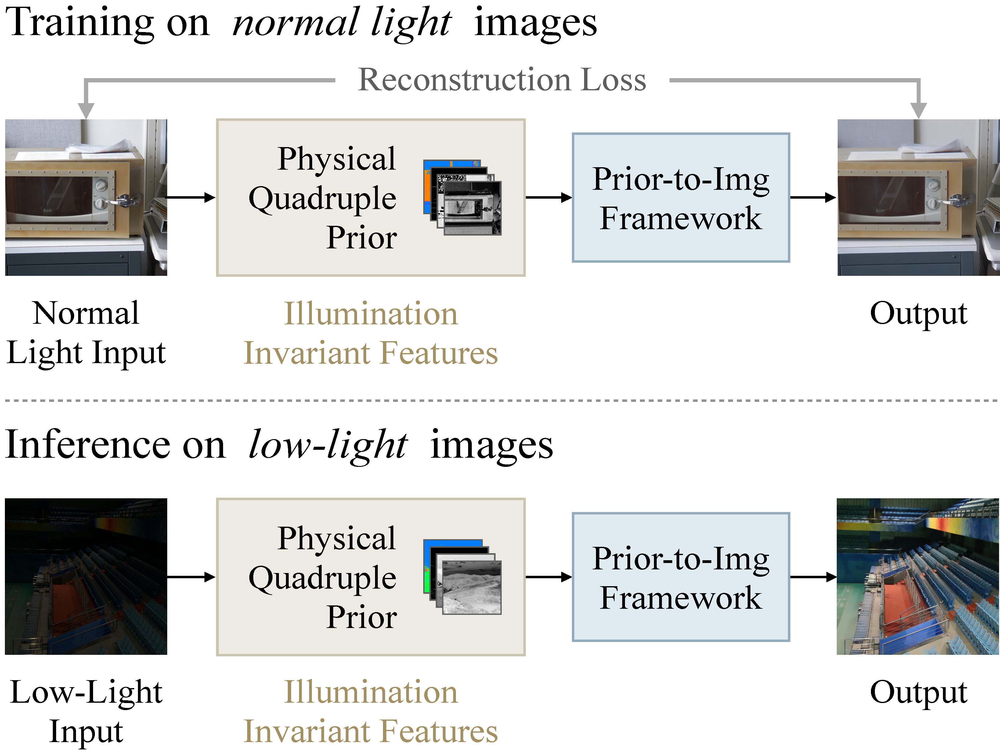
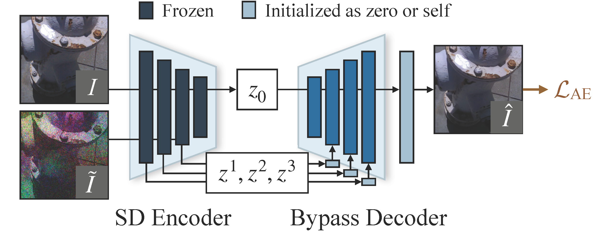
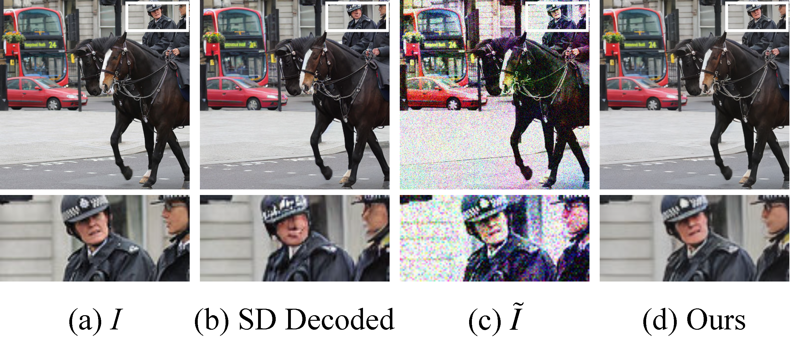
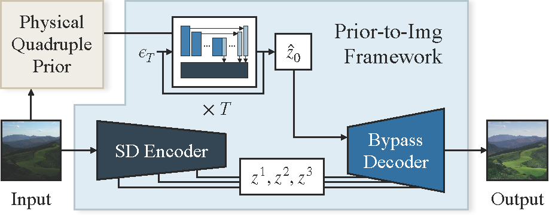





作者：[Wenjing Wang](https://daooshee.github.io/website/), [Huan Yang](https://hyang0511.github.io/), [Jianlong Fu](https://www.microsoft.com/en-us/research/people/jianf/), [Jiaying Liu](http://www.wict.pku.edu.cn/struct/people/liujiaying.html)

## 摘要

在弱光环境下，理解光照和减少监督需求是一项重大挑战。目前的方法对训练过程中的数据使用和特定光照的超参数高度敏感，限制了它们处理未知场景的能力。在本文中，我们提出了一种新的零参考低照度增强框架，该框架可仅使用正常光照下的图像进行训练。为此，我们从物理光传递理论中汲取灵感，设计了一种光照不变先验。这个先验值是连接正常光线图像和弱光图像的桥梁。然后，我们开发了一个先验图像框架，在没有弱光数据的情况下进行训练。在测试过程中，该框架能够将我们的光照不变先验恢复到图像中，自动实现弱光增强。在这一框架内，我们利用预训练生成扩散模型来提高模型能力，引入旁路解码器来处理细节失真，并提供一个轻量级版本以提高实用性。广泛的实验证明了我们的框架在各种情况下的优越性，以及良好的可解释性、鲁棒性和效率。

## 贡献点

开发了一个光照不变先验，源于 Kubelka-Munk 理论，将其作为低照度和正常光照图像之间的桥梁。训练时，仅使用正常光照图像，模型从图像分布中学习明亮照明的概念；在测试时，模型会自动提取低照度图像与光照无关的特征，然后转移到正常光照的图像中。这样，无需任何低照度图像、或者与照度有关的超参数，模型就能够在未知场景中进行低照度增强。

总结：

- 我们提出了一种零参考低照度增强模型，该模型利用照度不变先验作为不同照度之间的中介。我们的模型无需依赖任何特定的低照度数据，就能在各种低照度场景中表现出卓越的性能。
- 我们建立了物理四重先验，这是一种新颖的可学习的光照不变先验，源自光传递理论。该先验捕捉到了不同光照条件下成像的本质，使弱光增强摆脱了对参考样本或人为设置的超参数的依赖。
- 我们开发了一种有效的先验 - 图像映射系统，将先验作为控制预训练大规模生成扩散模型的条件。我们引入了一个旁路解码器来解决失真问题，并证明我们的模型可以提炼成一个轻量级版本以用于实际应用。

## 基于物理先验的图像复原

### 可学习的照明不变先验

#### 物理四重先验

从光传递的 Kubelka-Munk 理论出发。给定波长 $\lambda$，图像平面上位于空间位置 $\mathbf{x}$ 的入射光谱能量模型为

$$
E(\lambda,\mathbf{x}) = e(\lambda, \mathbf{x})\left((1-i(\mathbf{x}))^2R_\infty(\lambda,\mathbf{x})+i(\mathbf{x})\right)\text{.}\tag{1}
$$

其中，$e(\lambda, \mathbf{x})$ 表示光源光谱，$i(\mathbf{x})$ 表示镜面反射，$R_\infty(\lambda,\mathbf{x})$ 表示材料反射率。当物体是无光泽的时候，即 $i(\mathbf{x}) \approx 0$，式 (1) 可以简化为

$$
E(\lambda,\mathbf{x}) = e(\lambda, \mathbf{x})R_\infty(\lambda,\mathbf{x})\text{,}\tag{2}
$$

和 Retinex 模型相同。也就是说，Retinex 理论可以看作是 Kubelka-Munk 理论的一个特例。

首先，为了简便起见，我们将一些变量表示为

$$
E^{\lambda} = \frac {\partial E(\lambda,\mathbf{x})} {\partial \lambda}, \;
R_\infty^{\lambda} = \frac {\partial R_\infty(\lambda,\mathbf{x})} {\partial \lambda}\text{,} \tag{3}
$$
$$
E^{\lambda\lambda} = \frac {\partial^2 E(\lambda,\mathbf{x})} {\partial \lambda^2}, \;
R_\infty^{\lambda\lambda} = \frac {\partial^2 R_\infty(\lambda,\mathbf{x})} {\partial \lambda^2}\text{.} \tag{4}
$$

直观地，$E$ 表示光谱强度，$E^\lambda$ 表示光谱斜率，$E^{\lambda\lambda}$ 表示光谱曲率。

根据 [^1]，通过简化假设，我们可以从式 (1) 得到一系列不变量。主要思路是，去掉 $i$ 和 $e$ 的影响，只保留 $R_\infty$ 的影响。由于 $R_\infty$ 是材料的固有属性，因此在不同光照条件下，$R_\infty$ 是不变的。因此导出的变量可以表现出光照不变性。

- 假设等能量照明，即 $e(\lambda, \mathbf{x})$ 被简化为与 $\lambda$ 无关的 $e(\mathbf{x})$，那么式 (1) 可以简化为

    $$
    E(\lambda,\mathbf{x}) = \tilde{e}(\mathbf{x})\left((1-i(\mathbf{x}))^2R_\infty(\lambda,\mathbf{x})+i(\mathbf{x})\right)\text{,}\tag{5}
    $$

    将式 (5) 代入 $E^{\lambda}/E^{\lambda\lambda}$ 可得

    $$
    \frac{E^{\lambda}} {E^{\lambda\lambda}} = \frac {\tilde{e}(\mathbf{x})(1-i(\mathbf{x}))^2R_\infty^{\lambda}} {\tilde{e}(\mathbf{x})(1-i(\mathbf{x}))^2R_\infty^{\lambda\lambda}} = \frac{R_\infty^{\lambda}} {R_\infty^{\lambda\lambda}}\text{,}\tag{6}
    $$

    其中照明属性 $i$ 和 $e$ 被消除，只剩下材料属性 $R_\infty$。由于它和光照无关，因此它建立了 $E^{\lambda}/E^{\lambda\lambda}$ 的光照不变性。这样，第一个光照不变量是

    $$
    H = \arctan \left(  {E^{\lambda}} / {E^{\lambda\lambda}} \right) \text{.}\tag{7}
    $$

- 再假设表面是无光泽的，即 $i(\mathbf{x}) \approx 0$，那么式 (1) 可以简化为

    $$
    E(\lambda,\mathbf{x}) = \tilde{e}(\mathbf{x})R_\infty(\lambda,\mathbf{x})\text{,}\tag{8}
    $$

    类似地，我们可以推导出第二个光照不变量

    $$
    C = \log \left( \frac { (E^{\lambda})^2 + (E^{\lambda\lambda})^2} {E(\lambda,\mathbf{x})^2} \right) \nonumber \\
     = \log \left( \frac { (R_\infty^{\lambda})^2 + (R_\infty^{\lambda\lambda})^2} {R_\infty(\lambda,\mathbf{x})^2} \right) \text{.}\tag{9}
    $$

- 进一步假设光照均匀，即 $\tilde{e}(\mathbf{x})$ 简化为 $\bar{e}$，那么式 (1) 可以简化为

    $$
    E(\lambda,\mathbf{x}) = \bar{e}R_\infty(\lambda,\mathbf{x})\text{,}\tag{10}
    $$

    类似地，我们可以推导出第三个光照不变量

    $$
    W = \tan \left( \bigg| \frac {\partial E(\lambda,\mathbf{x})} {\partial \mathbf{x}} \frac 1 {E(\lambda,\mathbf{x})} \bigg| \right) \nonumber \\
    = \tan \left( \bigg| \frac {\partial R_\infty(\lambda,\mathbf{x})} {\partial \mathbf{x}} \frac 1 {R_\infty(\lambda,\mathbf{x})} \bigg| \right) \text{.}\tag{11}
    $$

Kubelka-Munk 理论对灰度图像很有效，但在色彩的解释上有一定的局限性。上述的三个光照不变式丢失了部分色彩信息。因此对于第四个光照不变式，我们描述了 RGB 三个通道像素值之间的相对关系。

- 假设光照会保持颜色的顺序，我们将 RGB 三个通道的顺序作为基本的光照不变特征，记为 $O$。

#### 通过神经网络学习

我们通过高斯色彩模型[^2]和 CIConv[^3] 来从 RGB 图像中获取先验。首先，我们通过线性映射估计观测到的能量 $\hat{E}$ 和它的导数 $\hat{E}^\lambda$、$\hat{E}^{\lambda\lambda}$

$$
\begin{bmatrix}
\hat{E}(x,y) \newline \hat{E}^\lambda(x,y) \newline \hat{E}^{\lambda\lambda}(x,y) \newline \end{bmatrix} = \mathcal{W}
\begin{bmatrix} R(x,y) \newline G(x,y) \newline B(x,y) \end{bmatrix}
\text{,}\tag{12}
$$

其中，$x$ 和 $y$ 分别表示图像中的位置，$\mathcal{W}$ 是 $3\times 3$ 的矩阵。在 [^2] [^3] 中，$\mathcal{W}$ 是手动设计的，而我们用我们的先验到图像框架通过自然图像的分布来学习它。

公式 (11) 中的空间导数 $\partial E / \partial \mathbf{x}$ 是在 x 和 y 方向上计算的，表示为 $\partial E / \partial \mathbf{x}=(E_x, E_y)$ ，其大小由 $|\partial E / \partial \mathbf{x}| = \sqrt{E_x^2 + E_y^2}$ 给出。最终，通过将 $\hat{E}$ 与高斯颜色平滑和尺度为 $\sigma$ 的导数滤波器进行卷积来估计 $E$、$E_x$ 和 $E_y$ 。$\sigma$ 是从输入图像中预测得出的。类似地，$E^{\lambda}$ 是从 $\hat{E}^{\lambda}$ 获得的，$E^{\lambda\lambda}$ 是从 $\hat{E}^{\lambda\lambda}$ 获得的。现在我们可以从输入图像中计算$H$、$C$ 和 $W$。

我们的最后一个光照不变量，即 RGB 通道的顺序，定义为如下三个通道

$$
O(x,y) = \left[ O_R(x,y), O_G(x,y), O_B(x,y) \right]\text{,}\tag{13}
$$

其中，$O_R$ 表示 RGB 图像中 $R$ 通道的顺序，标准化为 $[-1,1]$。$O_G$ 和 $O_B$ 同理。

最后，$H$、$C$、$W$ 和 $O$ 在通道维度上连接在一起，形成我们的物理四元先验。

#### 物理解释

首先，数学形式表示 $W$ 代表光谱强度的强度归一化空间导数。至于 $H$，根据[^1]，它和材料的色调有关，即材料的 $\arctan(\lambda_\text{max})$。而对于 $C$，在基于光谱波长的色环内，色调代表角度，而色度则是距离中心的距离。此外，当将笛卡尔坐标 $(a, b)$ 转换为极坐标时，角度变为 $\arctan(b/a)$ ，半径变为 $\sqrt{(a)^2+(b)^2}$ 。将这与方程 (7) 和方程 (9) 连接起来，我们发现 C 与色度相关联。

### 通过扩散模型构建先验到图像的框架

理想情况下，我们希望保留所有与光照无关的信息，同时舍弃与光照相关的信息。然而，实现这种分解具有挑战性，仍然是图像建模中尚未解决的问题。尽管我们的物理四元先验（即 $H$、$C$、$W$ 和 $O$）从不同角度捕捉了与光照无关的信息，但仍会丢失一些信息。因此，根据先验重建图像并不容易。

我们建议使用大模型来直接补全缺失的信息，而不是专注于改进光照不变先验。我们使用 Stable Diffusion v1-5 并使用 ControlNet 框架将其转为条件生成模式。将四个物理先验作为条件来控制生成模型。

在训练过程中，使用一个冻结的 SD 编码器将图像 $I$ 映射到压缩的潜在表示 $z_0$ 中。然后，我们在随机时间步长 $t\in\{1,...,T\}$ 处对 $z_t$ 进行采样，通过

$$
z_{t}=\sqrt{\bar{\alpha}_t}z_0+\sqrt{1-\bar{\alpha}_t} \epsilon\text{,}\tag{14}
$$

其中 $\{\bar{\alpha}_t\}$ 是一个预定义参数序列。训练目标是根据 $z_t$ 和我们的先验预测 $\epsilon$。起初，SD 利用 U-Net 来从 $z_t$ 预测 $\epsilon$，但 U-Net 现在被我们冻结了。我们添加了一组编码模块，以从我们的四重先验中提取特征。然后将这些特征纳入 SD U-Net 中。我们采用了零卷积策略[^4]，以确保在训练开始时，新的层不会影响原始 SD。在测试过程中，给定输入图像 $I$，我们提取物理四元先验，并将其作为反向扩散过程中预测 $z_0$ 的条件。随后，通过解码器将 $z_0$ 投影回图像空间。

虽然 ControlNet 在各种应用中都取得了成功，但直接应用它却存在收敛速度慢、细节退化和依赖文本提示等问题。为了解决这些问题，使其更适合我们的图像修复任务，我们进行了以下改进。

- 在典型的扩散模型中，训练目标是预测高斯噪声项：

    $$
    \mathcal{L}_{\text{noise}} = ||\epsilon-\hat{\epsilon}||^2_2\text{.}\tag{15}
    $$

    我们额外将 $z_0$ 的差值最小化，这可以加快收敛速度。结合公式 (14)，可以得出

    $$
    \mathcal{L}_{z_0} = ||z_0-\hat{z}_0||^2_2 = 
    ||z_0 - \frac{z_t-\sqrt{1-\bar{\alpha}_t}\hat{\epsilon}} {\sqrt{\bar{\alpha}_t}} ||^2_2\text{.}\tag{16}
    $$

    我们简单地将这两种损失合并为最终损失

    
$$
    \mathcal{L}_{\text{DIFF}} = \mathcal{L}_{z_0} + \mathcal{L}_{\text{noise}}\text{.}\tag{17}
    $$

- SD 采用自动编码器将图像 $I$ 压缩成潜在表示 $z_0$，从而降低了计算成本。但是，自动编码器会带来严重的细节失真。为了缓解这一问题，我们利用编码器的特征为解码器提供支持，并设计了一种有效的微调策略。
  
  

  如上图所示，在训练过程中，我们用随机光照抖动和噪声扭曲输入图像 $I$，得到 $\tilde{I}$。然后解码器结合从 $\tilde{I}$ 中提取的特征 $z^1$、$z^2$、$z^3$ 还原 $z_0$。我们引入了几个用于特征融合的卷积层和一个用于后处理的残差块。这些附加层初始化为零或 `self`，确保在训练开始时对原始解码过程的影响最小。新的解码器被命名为旁路解码器。

  

  如上图所示，我们的旁路解码器实现了明显的细节还原。如下图所示，在测试过程中，输入图像中的特征会辅助潜解码过程。我们的旁路解码器利用从输入图像中提取的 $z^1$、$z^2$ 和 $z^3$ 来重建细节，并在 $\hat{z}_0$ 中保持增强的光照度。

  

- Stable Diffusion 最开始是作为文本到图像模型设计的。然而，要求用户为低照度增强提供文本并不方便。为了解决这个问题，我们将文本输入设置为始终为空字符串。

#### 去噪

噪声是弱光增强中的一个重大挑战。虽然我们的先验并不是为去噪目的而设计的，但我们采用了一种简单的策略来抑制噪声。在训练过程中，我们对输入图像 $I$ 应用随机高斯 - 泊松复合噪声，同时提取物理四元先验。这种方法可以引导模型忽略高频细节，只关注低频与光照无关的信息。

#### 蒸馏提高效率

扩散模型在推理中需要多步优化。即使使用 DPM-Solver++[^5]，10 个步骤仍然非常繁琐。为了追求实用性，我们的框架可以创建一个更轻量级的版本。简而言之，我们构建了一个由残差块组成的轻量级 U-Net，并在瓶颈处集成了 Restormer[^6] 的 Transformer 块。事实证明，Transformer 在低级视觉中非常有效。然后，我们使用我们的框架制作 1.7k 个样本来训练轻量级模型。训练目标仅为 L1 损失。

[^1]: Jan-Mark Geusebroek, Rein van den Boomgaard, Arnold W. M. Smeulders, and Hugo Geerts. Color invariance. IEEE TPAMI, 23(12):1338–1350, 2001.

[^2]: Theo Gevers, Arjan Gijsenij, Joost Van de Weijer, and Jan-Mark Geusebroek. Color in computer vision: Fundamentals and applications. John Wiley & Sons, 2012.

[^3]: Attila Lengyel, Sourav Garg, Michael Milford, and Jan C. van Gemert. Zero-shot domain adaptation with a physics prior. In ICCV, 2021.

[^4]: Lvmin Zhang and Maneesh Agrawala. Adding conditional control to text-to-image diffusion models. In ICCV, 2023.

[^5]: Cheng Lu, Yuhao Zhou, Fan Bao, Jianfei Chen, Chongxuan Li, and Jun Zhu. Dpm-solver++: Fast solver for guided sampling of diffusion probabilistic models. arXiv, 2022.

[^6]: Syed Waqas Zamir, Aditya Arora, Salman Khan, Munawar Hayat, Fahad Shahbaz Khan, and Ming-Hsuan Yang. Restormer: Efficient transformer for high-resolution image restoration. In CVPR, 2022.
